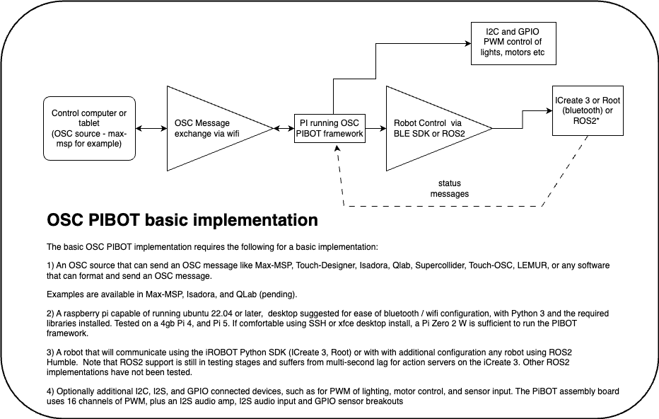
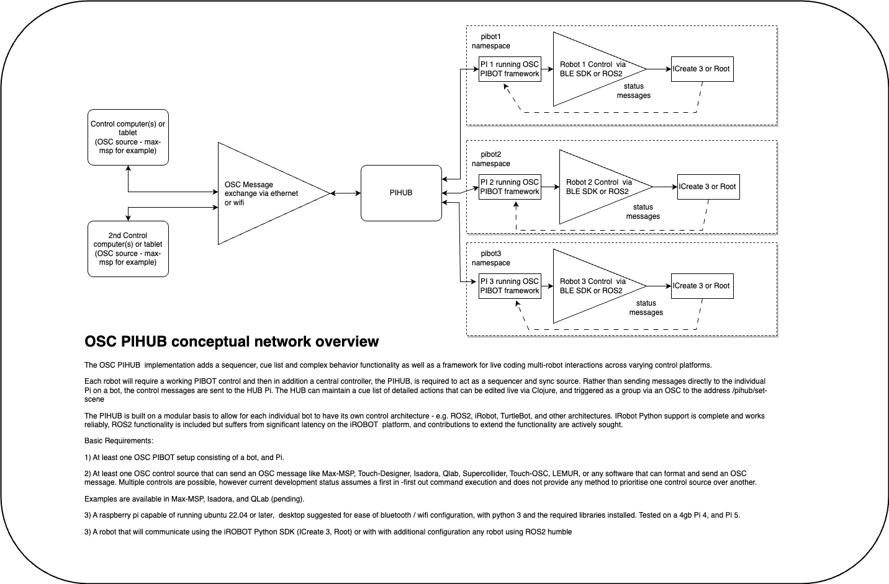
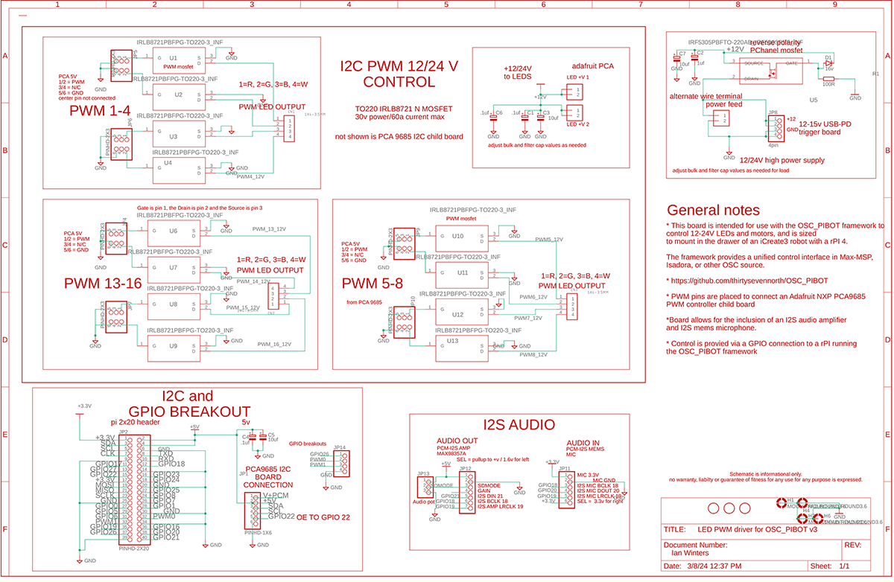
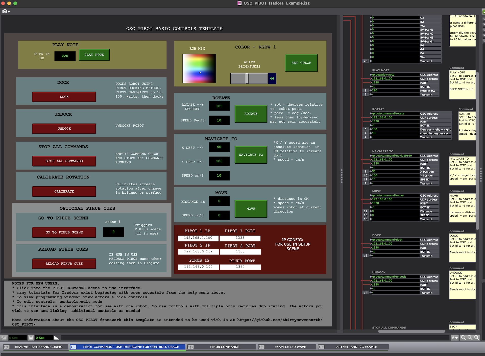

# EXAMPLE FILES AND DOWNLOADS
The following files are example files in a variety of software for the [OSC PIBOT](https://github.com/thirtysevennorth/OSC_PIBOT/blob/main/README.md)frameworks as well as example network diagrams.

**Pages:**
[README](README.md)
[SOFTWARE EXAMPLES](docs/Examples.md)
[PI CONFIGURATION](docs/Pi_CONFIGURATION.md)
[GITHUB REPO](https://github.com/thirtysevennorth/OSC_PIBOT)
[CUELIST EXAMPLE](docs/CueListExample.md)
[37 North on GITHUB](https://github.com/thirtysevennorth)


Examples are planned for Isadora, Qlab, Max-MSP / Pure-Data and Touch-OSC and contributions of samples for other software tools such as touchdesigner are welcomed. 

# PIBOT Network architecture
schematic of the [basic pibot architecture](OSC_PIBOT_SIMPLE.png)


schematic of [PIHUB with multiple bots](OSC_PIHUB.png)


Click to download a detailed network architecture diagram of a [3 robot network using the PIHUB](OSC_PIBOT_Network_Overview.pdf)

# LED and Motor Control Board Schematic
The PIBOT library is also intended to control and receive data from I2C, GPIO, and I2S connected to the Bot's Raspberry Pi. For the library a series of boards have been developed implmenting 12v-24v/3a channel PWM support for 12 channels of LED or motors using an NXP PCA9685 or the adafruit [PCA9685 board](https://learn.adafruit.com/16-channel-pwm-servo-driver), 4 channels of 5v/ 25ma PWM, and space to include an [Adafruit MAX9835757 I2S amplifier](https://learn.adafruit.com/adafruit-max98357-i2s-class-d-mono-amp/overview), and I2S mic board. I2S support in software is still experimental.

## Board schematic
The following is a [schematic of the circuit board](LED_PWM_driver_schematic.png) intended for use with the ICreate 3.0 but adaptable to any I2C / I2S use. 

Pleasecontact us for more copies of boards. 


## GPIO PINS used
The RPI GPIO pins in use on the board for I2C and I2S support
```
	Pin 2, 4  	5V power	
	Pin 6, 14	GND	
	Pin 3		SDA 	 GPIO2
	Pin 5		SCL 	 GPIO3
	Pin 12		PCM_CLK  GPIO18
	Pin 35		PCM_FS	 GPIO19
	Pin 37				 GPIO26 (for analog I/O)
	Pin 38		PCM_DIN	 GPIO20
	Pin 40		PCM-DOUT GPIO21
```
[download pinout diagram](PI-I2C_BOARD_PINOUT)


# EXAMPLE FILES

## PIHUB Cue List Example(written in Clojure)
This sample cue list provides an example of a cue list intended for use with the PIHUB to control multiple robots and devices via a single OSC cue.
[PIHUB Cue List Example](CueListExample.md)

## Isadora 3.2.6 example file
You can learn about [Isadora](https://troikatronix.com), download a trial or license it at [https://troikatronix.com](https://troikatronix.com).

This patch assumes a working Raspbery Pi running the PIBOT framework and Icreate robot in communication with it, and that the computer running Isadora is on the same local network with no barriers to sending OSC. Optionally it also assues a secondary circuit board for PWM/ Lighting / motor control. 

[**DOWNLOAD EXAMPLE FILE**](OSC_PIBOT_Isadora_Example.izz)




### Isadora Setup for PIBOT
requirements
 - Have a copy of [Isadora v 3.2.6](https://troikatronix.com/get-it)or later installed on your machine. 
 - Download and open the [Isadora Example file](OSC_PIBOT_Isadora_Example.izz) in Isadora 3.2.6 or later.
 - Enter the IP and port addresses for your PIBOT, HUB (if one) and secodary OSC target (if one) in the first scene.
 - Click to the PIBOT COMMANDS scene for a list of commands for the iCreate, and the PIHUB scene for additional commands to provide global scene control via the hub sequencer. 
 - To use the Isadora "controls" surface select View > Show Controls to show the controls surface made for the PIBOT commands. 
 
## [MAX-MSP](https://cycling74.com) example file
   - to do

## [TOUCH OSC](https://hexler.net/touchosc) Example Layout
   - to do 

## [TOUCHDESIGNER](https://derivative.ca/) example file
   - to do

## [QLab](https://qlab.com) Network Cue example file
   - Requires Qlab license enabled to send [Network Cues](https://qlab.app/docs/v5/networking/network-cues/) Example to do

## SUPERCOLLIDER example file
   - to do

## DOWNLOADS
   - [basic pibot architecture](OSC_PIBOT_SIMPLE.png)
   - [PIHUB with multiple bots](OSC_PIHUB.png)
   - [network architecture diagram](OSC_PIBOT_Network_Overview.pdf)
   - [schematic of the circuit board](LED_PWM_driver_schematic.png)
   - [PIHUB Cue List Example](CueListExample.md)
   - [Isadora Example file](OSC_PIBOT_Isadora_Example.izz)

